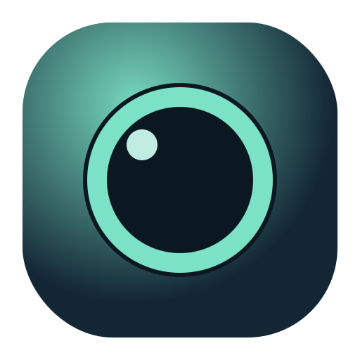

# Camlet



Camlet is a lightweight floating webcam app for desktop. It stays on top, keeps a clean transparent shell, and lets you quickly place your camera overlay where you want it by dragging it with the left mouse button.
Use the right mouse button anywhere inside it to show more options.

## Features

- always-on-top floating camera window
- frameless transparent overlay
- saved window position and size
- camera selection and persistence
- live language switching: `en` and `pt-BR`
- keyboard shortcuts for moving and resizing the overlay

## Shortcuts

These only work while the Camlet window is focused.

- `Arrow keys`: move the overlay by 1px
- `Shift + Arrow keys`: move the overlay by 24px
- `-` or `Numpad -`: decrease overlay size
- `=` or `Numpad +`: increase overlay size

## Running From Source

Requirements:

- Node.js 20+
- pnpm 9+

Install dependencies:

```bash
pnpm install
```

Start the app in development:

```bash
pnpm dev
```

## Build

Create a production build:

```bash
pnpm build
```

Package executables:

```bash
pnpm package:linux
pnpm package:win
```

Build artifacts are written to `release/`.

## Releases

GitHub Releases workflow builds:

- Linux AppImage
- Windows NSIS installer

## License

GPL-3.0-only
