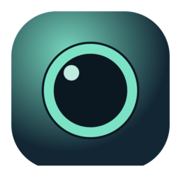

<!-- markdownlint-disable MD033 MD041 -->
<h1 align="center">Camlet</h1>

<p align="center">
  
</p>

<p align="center">
  <a href="https://github.com/rayan6ms/camlet/releases">
    
  </a>
  <a href="https://github.com/rayan6ms/camlet/stargazers">
    
  </a>
  <a href="https://github.com/rayan6ms/camlet/releases/latest">
    
  </a>
</p>

<p align="center">
  Camlet is a lightweight floating webcam app for desktop. It stays on top, keeps a clean transparent shell, and lets you quickly place your camera overlay where you want it by dragging it with the left mouse button.
</p>
<p align="center">
  Use the right mouse button anywhere inside it to show more options.
</p>
<!-- markdownlint-enable MD033 MD041 -->

## Features

- always-on-top floating camera window
- frameless transparent overlay
- saved window position and size
- camera selection and persistence
- live language switching: `en` and `pt-BR`
- keyboard shortcuts for moving and resizing the overlay

## Shortcuts

These only work while the Camlet window is focused.

- `Arrow keys`: move the overlay by 1px
- `Shift + Arrow keys`: move the overlay by 24px
- `-` or `Numpad -`: decrease overlay size
- `=` or `Numpad +`: increase overlay size

## Running From Source

Requirements:

- Node.js 20+
- pnpm 9+

Install dependencies:

```bash
pnpm install
```

Start the app in development:

```bash
pnpm dev
```

## Build

Create a production build:

```bash
pnpm build
```

Package executables:

```bash
pnpm package:linux
pnpm package:win
```

Build artifacts are written to `release/`.

## Releases

GitHub Releases workflow builds:

- Linux AppImage
- Windows NSIS installer

## License

GPL-3.0-only
